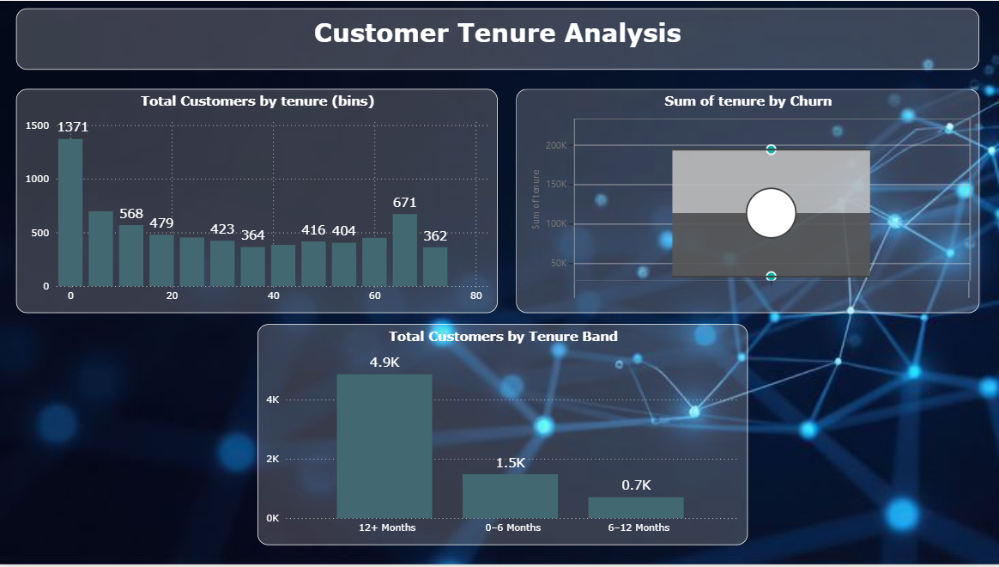

# ⏳ Customer Tenure Analysis Dashboard (Power BI)

## 1. Project Title / Headline
**Customer Tenure Analysis using Power BI**

---

## 2. Short Description / Purpose
This project focuses on analyzing **customer tenure**, measured in months, to understand how long customers stay with the service.  
The purpose of this analysis is to study **tenure distribution patterns**, identify customer concentration across different time ranges, and gain insights into overall customer retention behavior.

The dashboard uses statistical and categorical visualizations to represent tenure clearly and effectively.

---

## 3. Tech Stack
- **Power BI Desktop** – Dashboard development and visualization  
- **DAX (Data Analysis Expressions)** – Calculated measures and tenure bands  
- **Power Query Editor** – Data cleaning and data type transformation  
- **Excel / CSV** – Data source format  

---

## 4. Data Source
- **Telco Customer Churn Dataset**
- Key fields used in this analysis:
  - Customer ID
  - Tenure (in months)
  - Churn status (for comparative analysis)

*(Dataset used for academic and learning purposes.)*

---

## 5. Features
- 📊 **Customer Tenure Distribution (Histogram)**
  - Visualizes the distribution of customers across tenure bins (in months)

- 📦 **Customer Tenure Box Plot**
  - Displays statistical measures such as minimum, quartiles, median, maximum, and outliers

- 🗂 **Tenure Band Analysis**
  - Groups customers into meaningful tenure ranges (0–6, 6–12, 12+ months)
  - Shows customer count per tenure band

- 🔄 **Sum of Tenure by Churn Status**
  - Highlights the total accumulated tenure contributed by churned and non-churned customers

- 🎨 **Professional Dashboard Design**
  - Consistent dark theme
  - Clear labels and titles
  - Well-structured layout

---

## 6. Screenshot
📷 **Customer Tenure Analysis Dashboard Preview**

---

## 📌 Conclusion
The Customer Tenure Analysis dashboard provides a clear understanding of customer retention duration through histograms, box plots, and tenure band segmentation. This analysis helps identify retention patterns and supports data-driven decision-making related to customer lifecycle management.

---

## 🚀 Future Scope
- Tenure-wise churn rate analysis
- Integration of tenure with contract and billing data
- Predictive modeling based on tenure trends
